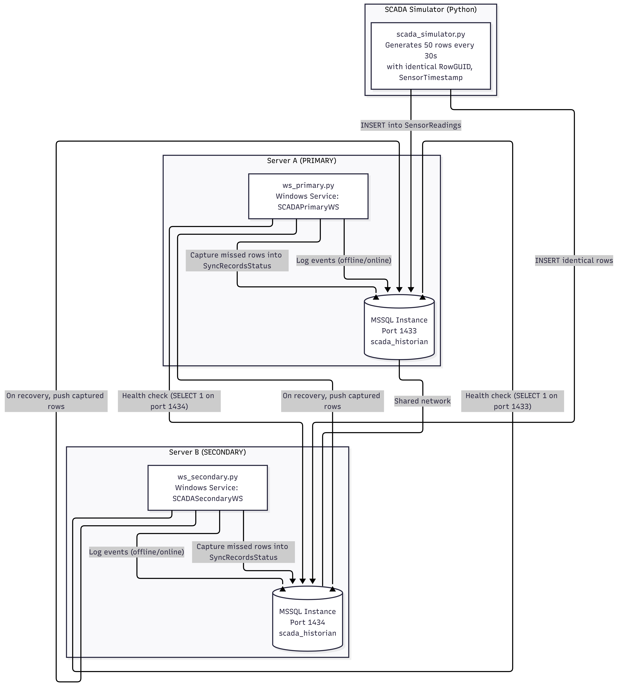
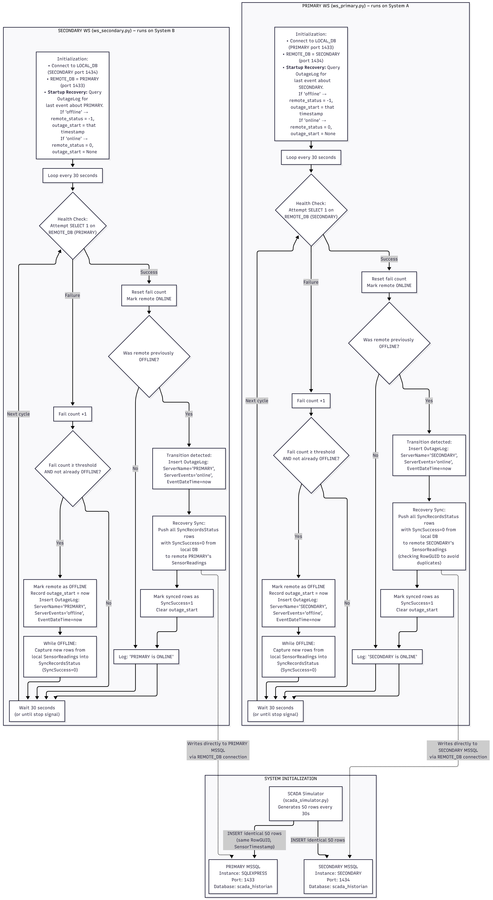

# SCADA High‑Availability Synchronisation System

A professional, industrial‑grade system that ensures two SQL Server instances remain perfectly synchronised, even when one server goes offline for any length of time.

The project simulates a real‑world SCADA environment: a data simulator continuously writes sensor readings to two independent MS SQL Server Express instances. Two separate Windows Services (one per server) monitor each other, log outages, and automatically recover any data missed while the partner was unreachable.

---

## Table of Contents

- [Architecture Overview](#architecture-overview)
- [Features](#features)
- [Prerequisites](#prerequisites)
- [Installation](#installation)
  - [1. SQL Server Instances](#1-sql-server-instances)
  - [2. Firewall Configuration](#2-firewall-configuration)
  - [3. Database Setup](#3-database-setup)
  - [4. Python Environment & Dependencies](#4-python-environment--dependencies)
  - [5. SCADA Simulator](#5-scada-simulator)
  - [6. Windows Services (WS)](#6-windows-services)
- [Configuration](#configuration)
- [Testing the System](#testing-the-system)
- [Monitoring and Logs](#monitoring-and-logs)
- [Troubleshooting](#troubleshooting)
- [Future Enhancements](#future-enhancements)

---

## Architecture Overview


**System Architecture:**




**Comprehensive System Flowchart:**




**Components:**

- **SCADA Simulator** (`python_simulator.py`) – generates realistic sensor data and writes the same batches to both databases every 30 seconds.
- **Two MS SQL Server Express Instances** – `PRIMARY` on port 1433, `SECONDARY` on port 1434. Each hosts an identical `scada_historian` database with three tables:
  - `SensorReadings` – the live sensor data.
  - `OutageLog` – a timeline of every offline/online event detected by the monitors.
  - `SyncRecordsStatus` – captures rows that were missed by the remote server during an outage, with a `SyncSuccess` flag.
- **Two independent Windows Services** – `SCADAPrimaryWS` and `SCADASecondaryWS`.  
  Each service runs on its own server and:
  1. Checks the remote server's SQL port every 30 seconds.
  2. Logs state changes (offline → online, online → offline) to its local `OutageLog`.
  3. While the remote is offline, continuously copies new local rows into `SyncRecordsStatus`.
  4. When the remote comes back online, pushes all captured rows to the remote database and marks them as synced.

The two services never communicate directly – they only interact with the databases. This makes the system fully distributed and resilient to individual service crashes or reboots.

---

## Features

- **Zero data loss** – all rows inserted during an outage are automatically recovered.
- **GUID‑based deduplication** – safe to run recovery multiple times; duplicates are automatically skipped.
- **Crash‑safe** – if a server (or its service) reboots mid‑outage, the service reads the last known outage timestamp from the database and resumes capturing.
- **Audit trail** – every outage and every recovered row is permanently stored in the database tables.
- **Human‑readable logs** – each service writes detailed log files to `C:\ScadaLogs\`.
- **Windows Service ready** – install, start, stop, and remove using standard `net` commands.
- **Scalable** – works on two separate physical machines (use Tailscale / static IPs) or locally for testing.

---

## Prerequisites

- Windows 10/11 or Windows Server (64‑bit)
- Administrator rights on both machines
- Python 3.8 or newer (Anaconda is fine)
- MS SQL Server 2022 Express (free) – [Download](https://www.microsoft.com/en-us/sql-server/sql-server-downloads)
- Git (optional)

---

## Installation

### 1. SQL Server Instances

We need two separate instances on the same machine (or one on each machine).

**a) Install the first instance (PRIMARY):**
1. Run the SQL Server installer → **Custom**.
2. On **Instance Configuration**, select **Named instance** and enter `PRIMARY`.
3. On **Database Engine Configuration**:
   - Choose **Mixed Mode** (SQL Server and Windows Authentication).
   - Set a strong `sa` password (e.g., `YourStrong!Passw0rd`).
   - Add your current Windows user as an administrator.
4. Complete the installation.

**b) Install the second instance (SECONDARY):**
1. Run the installer again.
2. On **Instance Configuration**, select **Named instance** and enter `SECONDARY`.
3. Use the **exact same `sa` password**.
4. Finish the installation.

**c) Configure static ports:**
1. Open **SQL Server Configuration Manager**.
2. Go to **SQL Server Network Configuration** → **Protocols for PRIMARY**:
   - Enable **TCP/IP**.
   - Double‑click TCP/IP → **IP Addresses** tab → scroll to **IPAll** → set **TCP Port** = `1433`, clear **TCP Dynamic Ports**.
3. Repeat for **Protocols for SECONDARY**, setting port **1434**.
4. Restart both services: `SQL Server (PRIMARY)` and `SQL Server (SECONDARY)`.

---

### 2. Firewall Configuration

If the two services will ever run on different physical machines, open the SQL ports.

In an **elevated PowerShell** on both machines:

```powershell
New-NetFirewallRule -DisplayName "SQL Primary" -Direction Inbound -Protocol TCP -LocalPort 1433 -Action Allow
New-NetFirewallRule -DisplayName "SQL Secondary" -Direction Inbound -Protocol TCP -LocalPort 1434 -Action Allow
```

---

### 3. Database Setup

Run the following SQL script on both instances. You can use SSMS, Azure Data Studio, or `sqlcmd`.

On **PRIMARY** (port 1433) and again on **SECONDARY** (port 1434):

```sql
-- Create the database
CREATE DATABASE scada_historian;
GO
USE scada_historian;
GO

-- Main sensor data table
CREATE TABLE SensorReadings (
    RowGUID CHAR(36) PRIMARY KEY,
    SensorTimestamp DATETIME2 NOT NULL,
    TagID INT NOT NULL,
    SensorDate DATETIME2 NOT NULL,
    Value FLOAT NOT NULL,
    Quality VARCHAR(20) DEFAULT 'Good'
);
GO

-- Outage event log
CREATE TABLE OutageLog (
    OutageID INT IDENTITY PRIMARY KEY,
    ServerName VARCHAR(50) NOT NULL,
    ServerEvents VARCHAR(50) NOT NULL,
    EventDateTime DATETIME2 NULL,
    SyncStatus VARCHAR(20) DEFAULT 'Pending',
    Notes VARCHAR(500) NULL
);
GO

-- Sync audit table (captures rows missed by remote)
CREATE TABLE SyncRecordsStatus (
    RowGUID CHAR(36) PRIMARY KEY,
    SensorTimestamp DATETIME2 NOT NULL,
    TagID INT NOT NULL,
    SensorDate DATETIME2 NOT NULL,
    Value FLOAT NOT NULL,
    Quality VARCHAR(20) DEFAULT 'Good',
    SyncSuccess BIT DEFAULT 0
);
GO
```

---

### 4. Python Environment & Dependencies

On each server, install the required Python packages.

**Option A – Using `requirements.txt` (recommended):**

Clone or copy this repository to the server, then run:

```cmd
pip install -r requirements.txt
```

**Option B – Manual install:**

```cmd
pip install pymssql pywin32
```

Ensure Python is in your PATH. If you use Anaconda, activate your environment first (`conda activate base` or your custom environment).

---

### 5. SCADA Simulator

The simulator can run on any machine that can reach both SQL instances.

1. Copy the file `python_simulator.py` to a convenient folder (e.g., `C:\ScadaSimulator\`).
2. Edit the script and set your `SA_PASSWORD`.
3. Open a terminal and run:

```cmd
python python_simulator.py
```

It will continuously insert 50 rows every 30 seconds. Press `Ctrl+C` to stop.

---

### 6. Windows Services

The service scripts are:

- `sync_service_primary.py` – runs on the PRIMARY server (port 1433), monitors SECONDARY.
- `sync_service_secondary.py` – runs on the SECONDARY server (port 1434), monitors PRIMARY.

**PRIMARY Server (port 1433):**

1. Copy `sync_service_primary.py` to a permanent folder (e.g., `C:\ScadaService\primary\`).
2. Edit the script and set your `SA_PASSWORD`.
3. Open an **elevated Command Prompt** and navigate to that folder.
4. Install and start the service:

```cmd
python sync_service_primary.py install
net start SCADAPrimaryWS
```

**SECONDARY Server (port 1434):**

1. Copy `sync_service_secondary.py` to a permanent folder (e.g., `C:\ScadaService\secondary\`).
2. Edit the script and set your `SA_PASSWORD`.
3. Install and start:

```cmd
python sync_service_secondary.py install
net start SCADASecondaryWS
```

**To stop or remove the services:**

```cmd
net stop SCADAPrimaryWS
python sync_service_primary.py remove
```

The same commands apply to the secondary service.

---

## Configuration

All configuration is done inside the service scripts themselves. The only value you must change is:

```python
SA_PASSWORD = 'YourStrong!Passw0rd'   # must match the SQL Server sa password
```

If you are deploying on two separate physical machines, also update the `REMOTE_DB` host entry:

```python
REMOTE_DB = {
    'server': '192.168.1.100',   # or Tailscale IP
    'port': 1433,
    ...
}
```

For local testing with both instances on the same machine, keep `localhost`.

---

## Testing the System

1. Start both SQL Server instances (they usually run automatically).
2. Start the SCADA simulator (it writes to both databases).
3. Start both Windows Services.
4. Open `C:\ScadaLogs\primary_logs.log` and `secondary_logs.log` to watch the monitors.

**Simulate an outage:**

1. Open `services.msc`, stop `SQL Server (SECONDARY)`.
2. The `primary_logs.log` will show "SECONDARY is OFFLINE".
3. Wait a minute, then restart `SQL Server (SECONDARY)`.
4. The log will show "SECONDARY back ONLINE" and report the number of rows synced.

**Verify data integrity:**

1. Connect to both databases with SSMS.
2. Run `SELECT COUNT(*) FROM scada_historian.dbo.SensorReadings` on both.
3. The counts must be identical.

---

## Monitoring and Logs

- **Log files:** `C:\ScadaLogs\primary_logs.log` and `secondary_logs.log`.
- **Database tables:**
  - `OutageLog` – timeline of every state change.
  - `SyncRecordsStatus` – rows captured during outages; `SyncSuccess = 1` means the row has been successfully synced to the remote.

---

## Troubleshooting

| Symptom | Likely Cause | Solution |
|---|---|---|
| Service fails to start | Missing `pywin32` or `pymssql` | `pip install pymssql pywin32` |
| "Access denied for user 'sa'" | Password mismatch | Verify `SA_PASSWORD` in the WS script matches the SQL Server sa password. |
| Remote always OFFLINE | Firewall blocking port | Check firewall rules; ensure TCP 1433 and 1434 are allowed. |
| No rows captured | Outage timestamp not set correctly | Check that the `OutageLog` contains an 'offline' entry with the correct `EventDateTime`. The WS service reads it on startup. |
| Duplicate rows | `RowGUID` constraint not working | Ensure `RowGUID` is the primary key; the sync script checks for existence before insert. |
| Startup sync not triggered after reboot | `fail_count` not initialized correctly | Ensure the latest code sets `fail_count = 1` in `__init__` when the last event was 'offline'. This fixes the transition detection. |

---

## Future Enhancements

- Add a simple dashboard (Flask) to view outage history and sync status.
- Export recovery records to CSV.
- Support multiple tables (Alarms, Equipment Status).
- Replace the 30‑second polling with SQL Server Service Broker for real‑time eventing.
